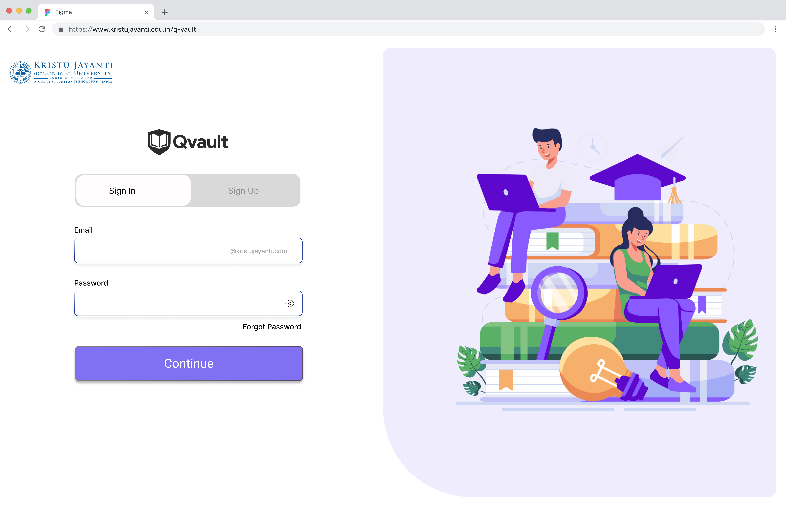
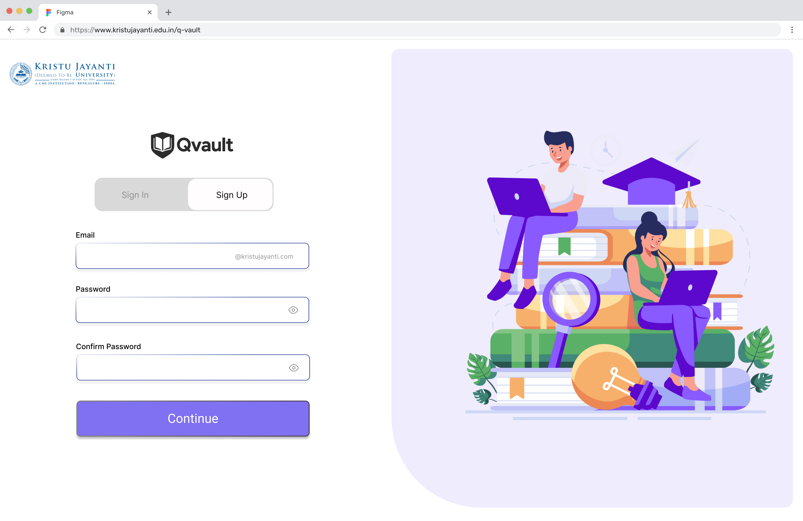
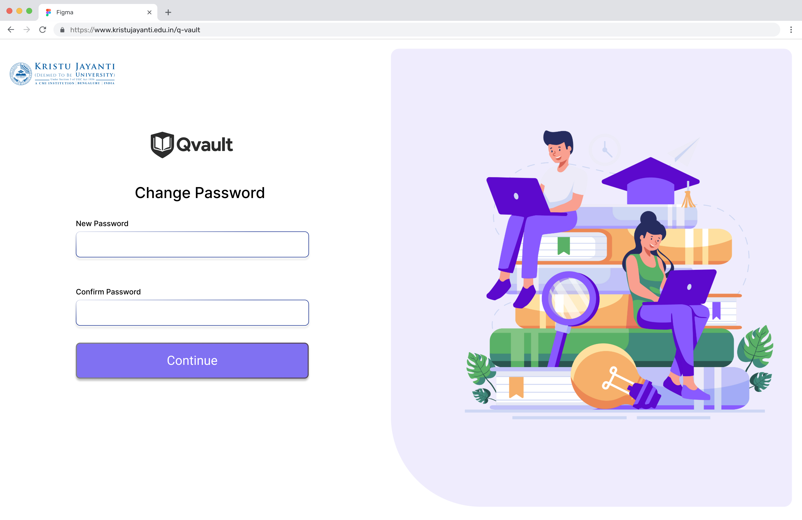
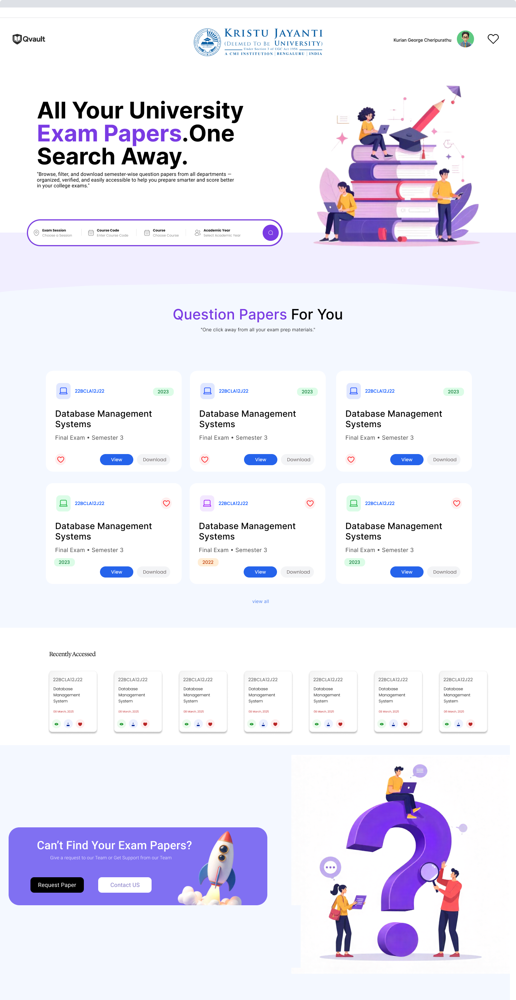
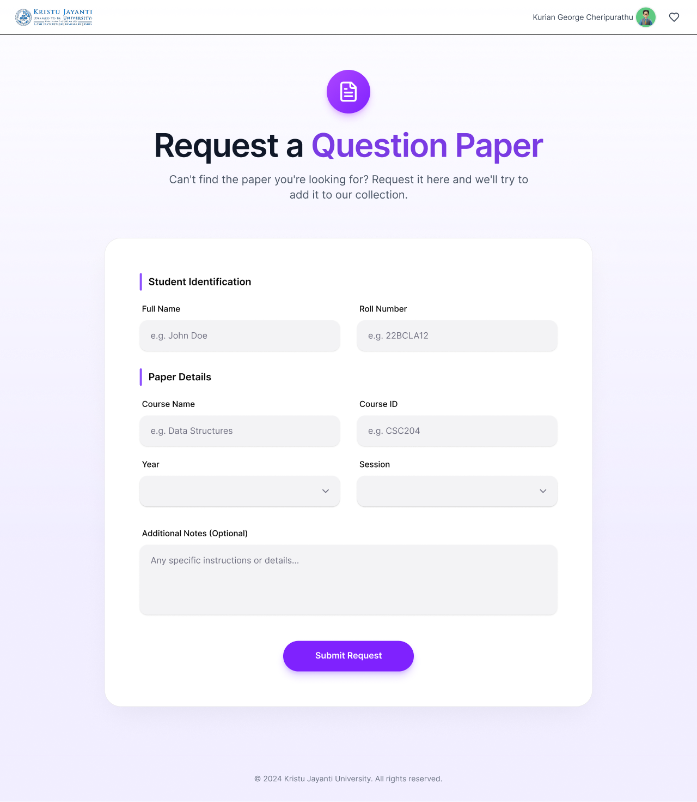
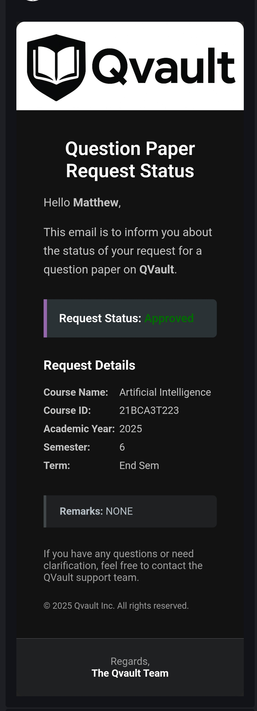
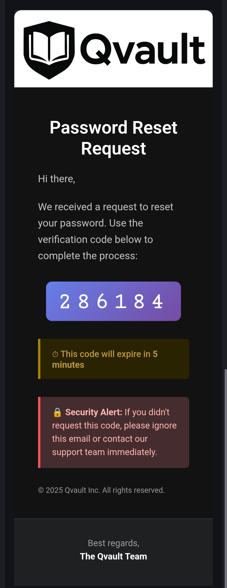
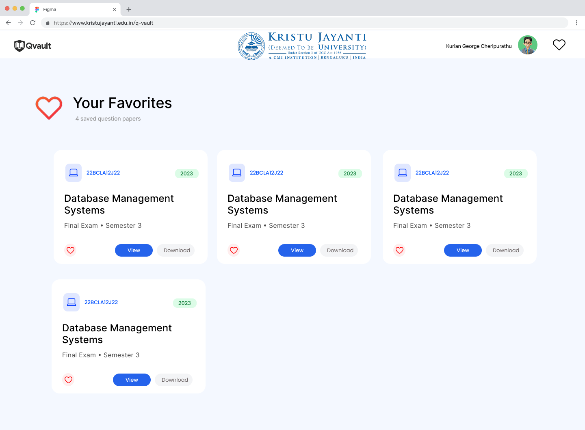
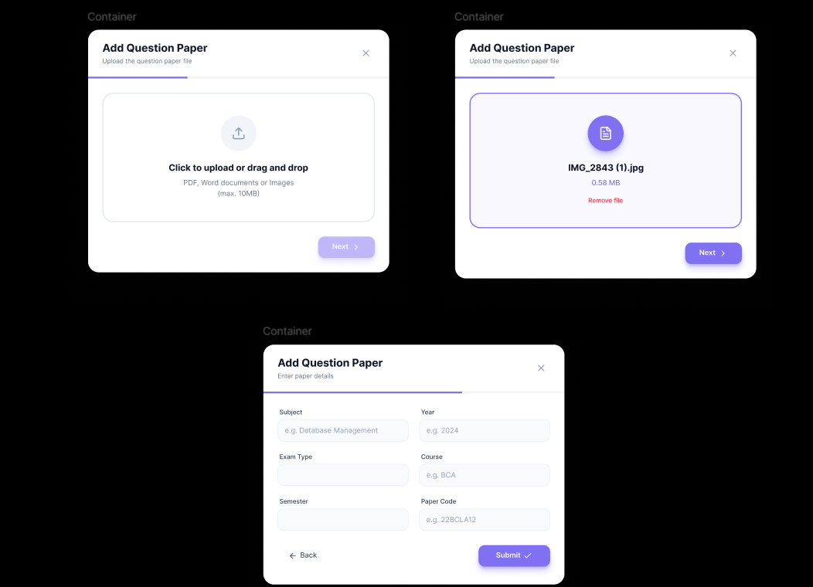
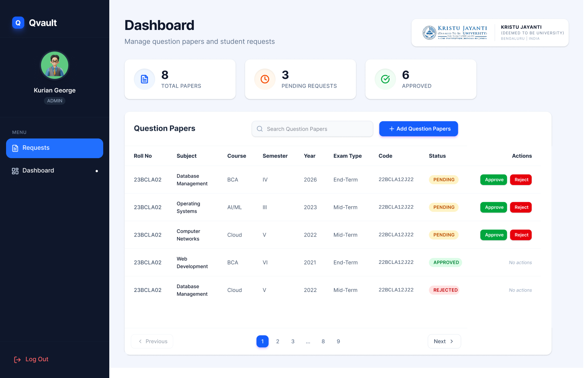

# QVault — Question Paper Vault

A Java backend for **QVault**, a question-paper repository system built for Kristu Jayanti College. Students can search, view, and request question papers, while admins manage uploads and handle requests. Built with Vert.x, MongoDB, Redis, and AWS (S3 + SES).

---

## Tech Stack

| Layer | Technology |
|---|---|
| Framework | [Vert.x](https://vertx.io/) 4.5.x (vertx-web) |
| Database | MongoDB (mongodb-driver-sync 5.3) |
| File Storage | AWS S3 |
| Email | AWS SES v2 |
| Auth | JWT (jjwt 0.9.1) + BCrypt (Spring Security Crypto) |
| Session / OTP cache | Redis (Jedis 6) |
| Language | Java 17 |
| Build | Maven |

---

## Project Structure

```
src/main/java/in/edu/kristujayanti/
├── Main.java                          # Entry point — deploys the Vert.x verticle
├── JwtUtil.java                       # JWT generation & validation helpers
├── AWSEmail.java                      # SES email sender (OTP, signup, request status)
├── handlers/
│   └── SampleHandler.java             # HTTP server setup, route registration
├── services/
│   ├── Authentication.java            # Signup, login, password reset, JWT auth guards
│   ├── CRUD.java                      # Admin: upload / update / delete papers (S3)
│   ├── StudentHome.java               # Student home, favourites, paper requests
│   ├── SearchAndGetPDF.java           # Search filters, presigned S3 PDF URLs
│   ├── AdminHome.java                 # Admin dashboard, request management
│   └── SampleService.java             # Legacy service (deprecated endpoints)
└── emailtemplates/
    ├── forgotpass.html
    ├── signupemail.html
    └── requestStatusUpdate.html
```

---

## Features

### OTP-based Authentication
Sign-up and password reset are two-step flows — the user first submits their email to receive a 6-digit OTP, then submits the OTP alongside their chosen password to complete the action. OTPs are stored in Redis with a 5-minute TTL and are deleted immediately after use. Passwords are hashed with BCrypt before being stored in MongoDB. Login issues a short-lived JWT access token (30 minutes) and a long-lived refresh token (7 days), both signed with HS512.

### Role-based Access Control
Every protected route runs through one of three JWT guard methods — `JWTauthguest`, `JWTauthadmin`, or `JWTauthSuperadmin` — before any handler logic executes. The guard validates the token signature and expiry, then cross-checks the role claim against the user's actual role in MongoDB, preventing privilege escalation even with a valid token. Admins additionally require an `Active` status, so deactivated accounts are blocked at the auth layer without needing token revocation.

- `Guest` — Students: search, view, favourites, paper requests
- `Admin` — Faculty: all Guest access + upload/update/delete papers, manage requests
- `SuperAdmin` — All Admin access + create/deactivate admin accounts

### Question Paper Storage on AWS S3
PDFs are uploaded via multipart form, streamed directly to S3 under a structured object key (`courseId/department/semester/year/filename.pdf`). Metadata (course name, course ID, department, programme, semester, exam term, year, paper type, uploader email, timestamps) is stored in MongoDB separately. This keeps the database lean — MongoDB holds only metadata while S3 handles the binary files.

### Secure PDF Access via Presigned URLs
When a student requests a PDF, the backend generates a presigned S3 URL valid for 10 minutes using `S3Presigner`. The actual file bytes never pass through the application server — the client fetches the PDF directly from S3 using the time-limited URL. This offloads bandwidth and prevents unauthorized hotlinking.

### Smart Search & Filtering
Students can filter question papers by course (selected as a combined `courseCode - courseName` string), exam term, year, and other attributes. A companion `searchlist` endpoint dynamically returns only the terms and years that actually exist for a selected course, keeping dropdowns clean and context-aware. Results are paginated at six papers per page.

### Recently Viewed Papers
Every time a student opens a PDF, their `recents` list in MongoDB is updated — the viewed paper is moved to the front and the list is capped at eight entries (oldest is dropped when full). This powers a "recently viewed" section on the student home screen without any separate tracking collection.

### Favourites
Students can add or remove papers from a personal favourites list stored as an array of `ObjectId` references in their user document. The student home endpoint returns up to six favourites inline alongside recents and filter options, so the home screen loads in a single request.

### Paper Request Workflow
Students can submit a request for a paper that isn't yet in the vault (course name, code, year, semester, term, and optional remarks). Requests are stored in a dedicated `Requests` collection. A stats document in the same collection tracks running totals of pending and approved counts, updated atomically on every request submission and status change.

### Admin Request Management with Email Notifications
Admins can view paginated pending requests and approve or reject them. On a status change the request record is updated, the stats counters are adjusted, and an HTML email is dispatched to the student via AWS SES with the full request details, the new status, and any remarks. Processed request documents are automatically cleaned up from MongoDB using a TTL index — a `deleteAt` field is set to 2 minutes after processing, and MongoDB's TTL mechanism deletes the document automatically.

### Transactional Email via AWS SES
All outbound emails are sent as raw MIME messages with the Qvault logo embedded as a CID inline attachment, ensuring the logo renders in email clients without being blocked as an external image. Three HTML templates handle sign-up OTP, password reset OTP, and request status updates, with `{{placeholder}}` tokens replaced at send time.

### Admin Dashboard
The admin home endpoint returns a snapshot of system stats in one call: total question papers in the vault, pending request count, and approved request count, alongside a deduplicated list of all courses currently in the system. A separate paginated endpoint serves the full question paper list with formatted timestamps for display.

### Super Admin — Admin Account Management
A SuperAdmin can create new admin accounts (default password `1234`, role `Admin`, status `Active`), toggle an admin's status between `Active` and `Inactive`, and retrieve a paginated list of all admins with their designation and creation date. Deactivated admins are immediately locked out at the JWT auth layer.

---

## API Endpoints

### Authentication

| Method | Path | Description |
|---|---|---|
| POST | `/qvault/usersign` | Sign up (step 1: send OTP; step 2: verify & register) |
| POST | `/qvault/userlog` | Login — returns access + refresh JWT |
| POST | `/qvault/resetpass` | Forgot password (step 1: send OTP; step 2: reset) |

### Student

| Method | Path | Description | Auth |
|---|---|---|---|
| GET | `/qvault/studenthome2` | Home data — courses, recents, favourites | Guest+ |
| POST | `/qvault/searchfilternew` | Filter question papers | Guest+ |
| POST | `/qvault/searchlist` | Get available terms/years for a course | Guest+ |
| POST | `/qvault/getpdf` | Get a presigned S3 URL for a PDF | Guest+ |
| POST | `/qvault/requestpaper` | Submit a paper request | Guest+ |
| POST | `/qvault/addFavs` | Add paper to favourites | Guest+ |
| POST | `/qvault/deleteFavs` | Remove paper from favourites | Guest+ |
| GET | `/qvault/showFavs` | List all favourites | Guest+ |

### Admin

| Method | Path | Description | Auth |
|---|---|---|---|
| POST | `/qvault/adminhome` | Dashboard stats | Admin+ |
| POST | `/qvault/adminhomeQP` | Paginated question paper list | Admin+ |
| POST | `/qvault/uploadQPS3` | Upload a question paper (PDF → S3) | Admin+ |
| PUT | `/qvault/handleupdateS3` | Update paper metadata or replace PDF | Admin+ |
| DELETE | `/qvault/handledeleteS3` | Delete paper from S3 + DB | Admin+ |
| POST | `/qvault/adminrequests` | List pending paper requests | Admin+ |
| POST | `/qvault/requeststatusupdate` | Approve or reject a request | Admin+ |

### Super Admin

| Method | Path | Description | Auth |
|---|---|---|---|
| POST | `/qvault/createAdmin` | Create an admin account | SuperAdmin |
| POST | `/qvault/Adminstatus` | Activate / deactivate an admin | SuperAdmin |
| POST | `/qvault/listAdmins` | List all admins (paginated) | SuperAdmin |

> **Deprecated endpoints** (`/qvault/uploadQP`, `/qvault/handleupdate`, `/qvault/handledelete`, `/qvault/getpdfold`, `/qvault/searchfilter`, `/qvault/studenthome`) use GridFS and are kept for backward compatibility only.

---

## Email Templates

HTML templates live under `emailtemplates/` and use `{{placeholder}}` syntax for dynamic values. The logo is embedded as a CID inline attachment.

| Template | Trigger |
|---|---|
| `signupemail.html` | New user registration OTP |
| `forgotpass.html` | Password reset OTP |
| `requestStatusUpdate.html` | Request approved / rejected notification |

---

## Notes

- CORS is open (`*`) — restrict to your frontend origin in production.
- `SampleService.java` duplicates much of the logic now split across `Authentication`, `CRUD`, `StudentHome`, `SearchAndGetPDF`, and `AdminHome`. New features should go into the dedicated service classes.

---

# Screenshots
### Sign In


### Sign Up


### Forgot Password


### Student-Homepage


### Student-Request


### Email Template for Paper Request


### Email Template for Password OTP


### Student-favs


### Add-QP


### Admin-Dashboard


### Admin-Request



